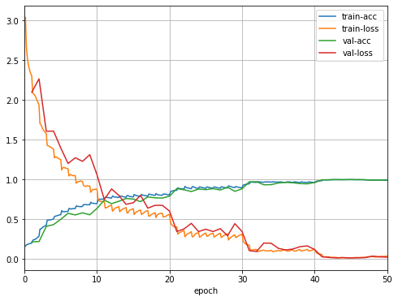

# CIFAR10-End2End

By Danh Doan

## Introduction
This repository serves my purpose of implementing and experiencing different modern Convolutional Neural Networks and using them to solve the well-known [**CIFAR10**](https://www.cs.toronto.edu/~kriz/cifar.html) dataset. MXNet is used as the main framework for Deep Learning.

> When conducting experiment with CNN architectures, I use the same training parameters to draw a comparison between various CNNs. To efficiently utilize each network, experiment with another training parameters.

## Current Results
|Architecture | Model | Accuracy|
|--|--|--|
| VGG | VGG11 | 95.68% |
|| VGG13 | 95.06% |
|| VGG16 | 94.32% |
|| VGG19 | 90.66% |
|ResNet | ResNet18 | 91.12% |
|| ResNet34 | 99.35% |
|| ResNet50 | 98.66% |
|| ResNet101 | 99.11% |
|| ResNet152 | 99.35% |

## Training History
* VGG11:

* ResNet152:

## Latest Updates
* 2019, Aug 8:
  * Implement and Test with all **ResNet** architectures [[paper]](https://arxiv.org/abs/1512.03385)

* 2019, Aug 7:
	* Set up the training and test program
	* Implement and Test with all **VGG** architectures [[paper]](https://arxiv.org/abs/1409.1556)

## Installation
* Install MXNet framework
	* For CPU only:
	
		`pip install mxnet`
	
	* For GPUs
		
		`pip install mxnet-cu90`
	
