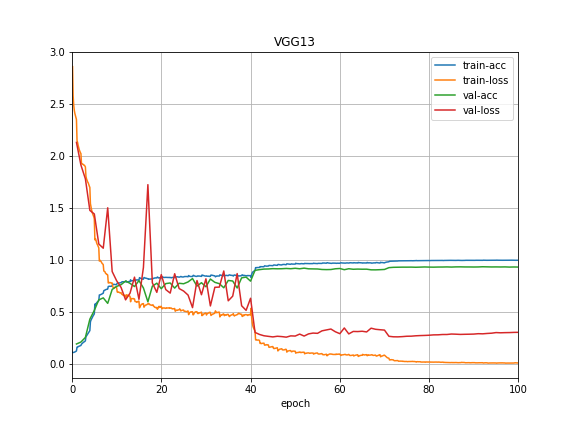
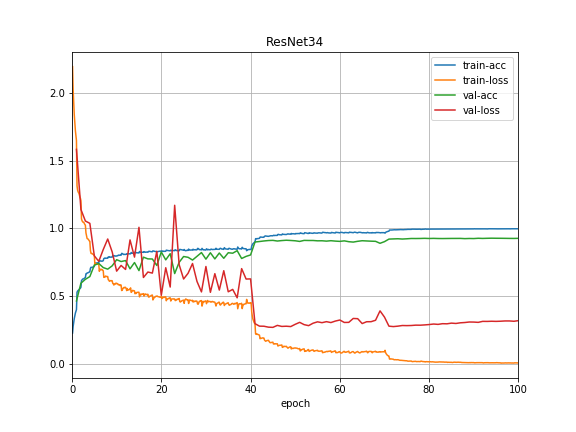
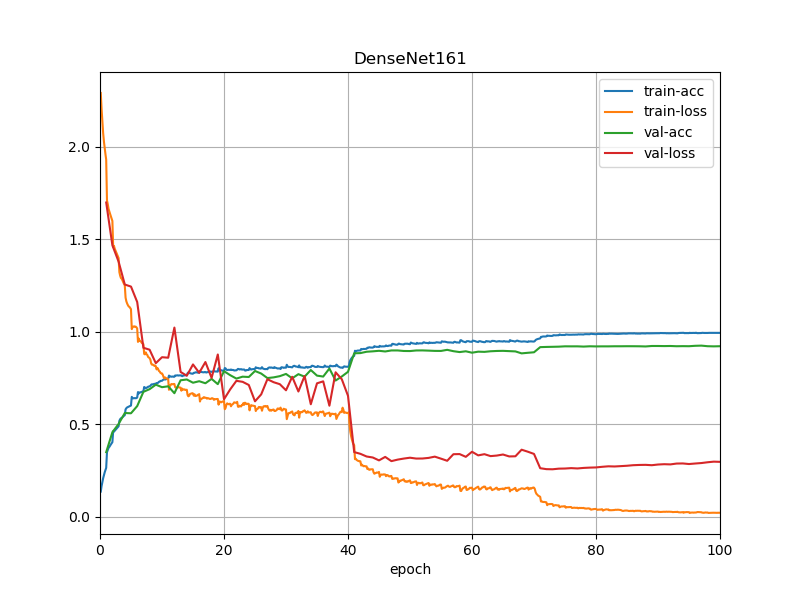
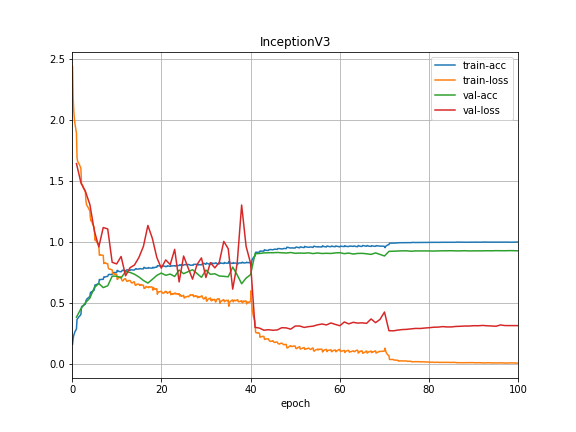

# CIFAR10-End2End-MXNet

By Danh Doan

## Introduction
This repository serves my purpose of implementing and experiencing different modern Convolutional Neural Networks and using them to solve the well-known [**CIFAR10**](https://www.cs.toronto.edu/~kriz/cifar.html) dataset. MXNet is used as the main framework for Deep Learning.

> When conducting experiment with CNN architectures, I use the same training parameters to draw a comparison between various CNNs. To efficiently utilize each network, experiment with another training parameters.

All networks are trained end-to-end and are implemented from scratch. 
Besides, Batch Normalization and Drop Out layers are applied whenever possible
to increase the Accuracy and avoid Overfitting.

## Learning Rate Scheduler
  * Epoch [0, 40): LR = 0.1
  * Epoch [40, 70): LR = 0.01
  * Epoch [70, 100): LR = 0.001

## Current Results
|Architecture | Model        | Accuracy| # Params |
|-------------|--------------|---------|----------|
| AlexNet     | AlexNet      | 88.34%  | 27.31M   |
| VGG         | VGG11        | 91.43%  | 14.50M   |
|             | VGG13        | 93.48%  | 14.68M   |
|             | VGG16        | 92.71%  | 20M      |
|             | VGG19        | 92.22%  | 25.31M   |
| ResNet      | ResNet18     | 92.72%  | 11.19M   |
|             | ResNet34     | 92.84%  | 21.31M   |
|             | ResNet50     | 91.73%  | 23.59M   |
|             | ResNet101    | 91.12%  | 42.66M   |
|             | ResNet152    | 90.73%  | 58.38M   |
| DenseNet    | DenseNet121  | 91.67%  | 3.27M    |
|             | DenseNet161  | 92.50%  | 12.30M   |
|             | DenseNet169  | 92.26%  | 5.99M    |
|             | DenseNet201  | 92.04%  | 8.5M     |
| GoogleNet   | GoogleNet    | 85.31%  | 6.07M    |
| Inception   | Inception V3 | 92.87%  | 19.33M   |

## Training History
* AlexNet:

* VGG13:

* ResNet34:

* DenseNet161:

* Inception-V3:

## Latest Updates
* 2019, Aug 13:
  * Implement and Test with all **Inception V3** architectures [[paper]](https://arxiv.org/pdf/1512.00567.pdf)

* 2019, Aug 12:
  * Implement and Test with all **GoogleNet** architectures [[paper]](https://www.cs.unc.edu/~wliu/papers/GoogLeNet.pdf)

* 2019, Aug 10:
  * Implement and Test with all **DenseNet** architectures [[paper]](https://arxiv.org/abs/1608.06993)

* 2019, Aug 8:
  * Implement and Test with all **ResNet** architectures [[paper]](https://arxiv.org/abs/1512.03385)
  * Implement and Test with all **AlexNet** architectures [[paper]](https://papers.nips.cc/paper/4824-imagenet-classification-with-deep-convolutional-neural-networks.pdf)

* 2019, Aug 7:
	* Set up the training and test program
	* Implement and Test with all **VGG** architectures [[paper]](https://arxiv.org/abs/1409.1556)

## Installation
* Install MXNet framework and GluonCV toolkit
	* For CPU only:
	
		`pip install mxnet gluoncv`
	
	* For GPUs
		
		`pip install mxnet-cu90 gluoncv`
    	> Change to match with CUDA version. `mxnet-cu100` if CUDA 10.0 is installed
	
