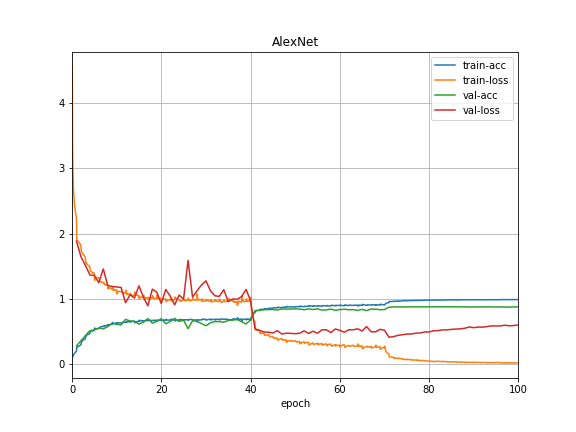

# CIFAR10-End2End-MXNet

By Danh Doan

## Introduction
This repository serves my purpose of implementing and experiencing different modern Convolutional Neural Networks and using them to solve the well-known [**CIFAR10**](https://www.cs.toronto.edu/~kriz/cifar.html) dataset. MXNet is used as the main framework for Deep Learning.

> When conducting experiment with CNN architectures, I use the same training parameters to draw a comparison between various CNNs. To efficiently utilize each network, experiment with another training parameters.

All networks are trained end-to-end and are implemented from scratch. 
Besides, Batch Normalization and Drop Out layers are applied whenever possible
to increase the Accuracy and avoid Overfitting.

## Current Results
|Architecture | Model     | Accuracy|
|-------------|-----------|---------|
| VGG         | VGG11     | %  |
|             | VGG13     | %  |
|             | VGG16     | %  |
|             | VGG19     | %  |
| ResNet      | ResNet18  | %  |
|             | ResNet34  | % |
|             | ResNet50  | % |
|             | ResNet101 | % |
|             | ResNet152 | % |
|AlexNet      | AlexNet   | 88.34%  |

## Training History
* AlexNet:

## Latest Updates
* 2019, Aug 8:
  * Implement and Test with all **ResNet** architectures [[paper]](https://arxiv.org/abs/1512.03385)
  * Implement and Test with all **AlexNet** architectures [[paper]](https://papers.nips.cc/paper/4824-imagenet-classification-with-deep-convolutional-neural-networks.pdf)

* 2019, Aug 7:
	* Set up the training and test program
	* Implement and Test with all **VGG** architectures [[paper]](https://arxiv.org/abs/1409.1556)

## Installation
* Install MXNet framework
	* For CPU only:
	
		`pip install mxnet`
	
	* For GPUs
		
		`pip install mxnet-cu90`
    	> Change to match with CUDA version. `mxnet-cu100` if CUDA 10.0 is installed
	
